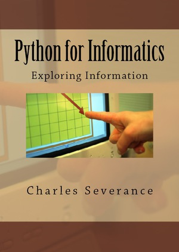
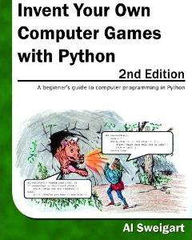

Literature
===================

Think Python
-------------------

[Description of the book](http://www.greenteapress.com/thinkpython/thinkpython.html).

[Book as PDF](thinkpython/thinkpython.pdf).

This work is licensed under the Creative Commons Attribution-NonCommercial-ShareAlike 4.0 International License, http://creativecommons.org/licenses/by-nc-sa/4.0/.

Dive intro Python 3
-------------------

[Description of the book](http://www.diveintopython3.net/).

[Book as PDF](dive-into-python3/dive-into-python3.pdf).

This work is licensed under the Creative Commons Attribution-ShareAlike 3.0 International License, http://creativecommons.org/licenses/by-sa/3.0/.

Python for Informatics: Python for Informatics
-------------------

[Description of the book](http://pythonlearn.com/book.php).

[Book as PDF](python-for-informatics/python-for-informatics.pdf).

This work is licensed under a Creative Common Attribution-NonCommercial-ShareAlike 3.0 Unported License http://creativecommons.org/licenses/by-nc-sa/3.0/ 

Invent Your Own Computer Games with Python
--------------------

[Description of the book](http://inventwithpython.com/chapters/).

[Book as PDF](games-with-python/games-with-python.pdf).

This work is licensed under a Creative Common Attribution-NonCommercial-ShareAlike 3.0 United States License http://creativecommons.org/licenses/by-nc-sa/3.0/us/ 

